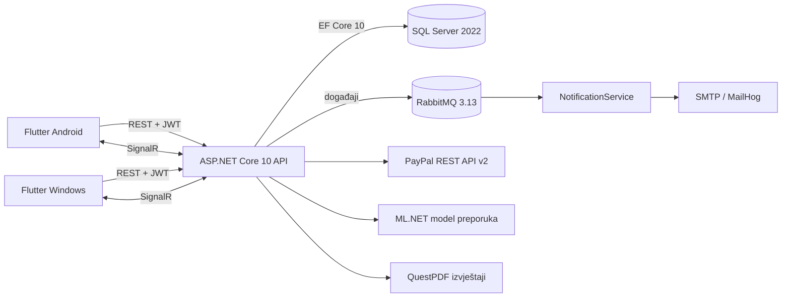
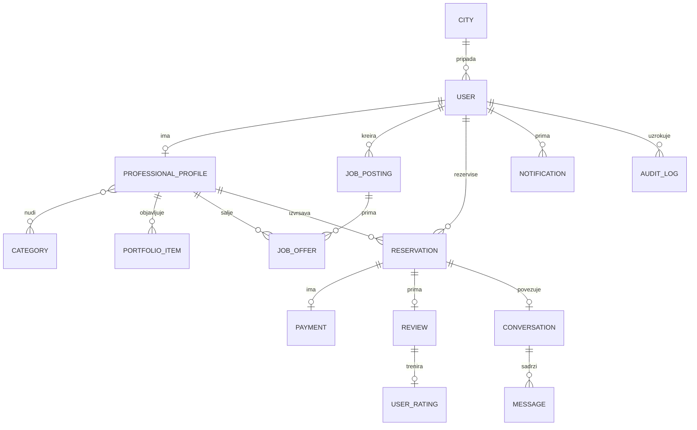
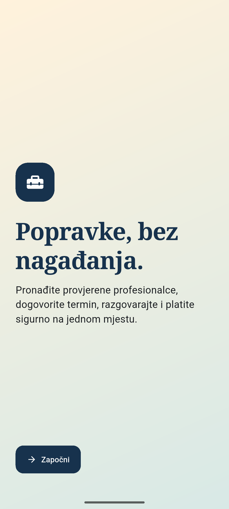
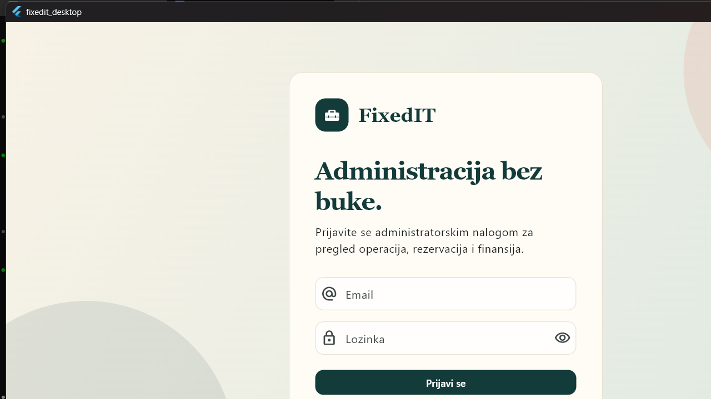

# FixedIT - tehnička dokumentacija

## 1. Opis projekta

FixedIT je platforma koja povezuje klijente i profesionalce za kućne i poslovne usluge. Klijent može pronaći profesionalca, objaviti oglas, prihvatiti ponudu, rezervisati termin, razgovarati, platiti i ostaviti recenziju. Profesionalac upravlja profilom i portfolijem, šalje ponude, vodi rezervacije kroz definisani životni ciklus i prati prihod. Administrator koristi Windows aplikaciju za nadzor korisnika, profesionalaca, rezervacija, evidencije aktivnosti i finansijskih izvještaja.

Sistem čine ASP.NET Core 10 API, pozadinski servis za email obavijesti, SQL Server, RabbitMQ, Flutter Android aplikacija i Flutter Windows aplikacija. Svi datumi u backendu čuvaju se u UTC vremenu, podaci se straniče na nivou baze, a konfiguracija i tajne ne nalaze se u izvornom kodu.

## 2. Arhitektura sistema



| Komponenta | Uloga |
|---|---|
| `backend/FixedIT.API` | REST API, autentikacija, autorizacija, poslovna pravila, SignalR, EF Core, PayPal, preporuke i PDF izvještaji |
| `backend/FixedIT.NotificationService` | `BackgroundService` koji koristi `AsyncEventingBasicConsumer`, obrađuje RabbitMQ poruke i šalje email |
| `backend/FixedIT.Shared` | Zajednička RabbitMQ konfiguracija i tipizovane poruke između servisa |
| `mobilne/fixedit_mobile` | Android klijent za klijente i profesionalce |
| `desktop/fixedit_desktop` | Windows administratorski klijent |
| SQL Server | Relacioni podaci, Identity nalozi, rezervacije, plaćanja, ocjene i audit zapisi |
| RabbitMQ | Pouzdana asinhrona dostava obavijesti, uz dead-letter red |

API koristi slojeve kontrolera, servisa, DTO modela i EF Core modela. `AppDbContext` je scoped. Neočekivane greške presreće globalni middleware bez slanja stack tracea klijentu. Poslovne greške koriste `BusinessException`, a nedostajući resursi `NotFoundException`.

## 3. Preduslovi i konfiguracija

Potrebni su:

- .NET SDK 10.x
- Flutter stable 3.22 ili noviji
- Docker Desktop sa `docker compose`
- Visual Studio sa Windows desktop C++ alatima za EXE build
- Android SDK API 34, JDK 21 i ADB za APK i emulator

Lokalna konfiguracija:

```powershell
# Raspakirati .env-tajne.zip šifrom dostavljenom uz predaju rada
& "C:\Program Files\7-Zip\7z.exe" e .env-tajne.zip -o. -p<šifra>
```

`.env-tajne.zip` nalazi se u root direktoriju repozitorija i sadrži sve potrebne vrijednosti. `.env` se ne commituje, a referentni opis svih varijabli nalazi se u `.env.example`. Operativna konfiguracija se centralno prosljeđuje servisima iz `.env` kroz Docker Compose; `appsettings.json.example` fajlovi namjerno ne sadrže runtime vrijednosti. Flutter klijenti dobijaju API adresu isključivo kroz `--dart-define=API_BASE_URL=...`.

## 4. Pokretanje sistema

### 4.1 Docker Compose

```powershell
Set-Location C:\Users\TarikK\Desktop\dev\FixedIT-RSII
docker compose config --quiet
docker compose up --build -d
docker compose ps
Invoke-RestMethod http://localhost:5000/health
```

Očekivani odgovor health provjere je `Healthy`. Servisi i portovi:

| Servis | Lokalna adresa |
|---|---|
| FixedIT API | `http://localhost:5000` |
| SQL Server | `localhost:1433` |
| RabbitMQ | `localhost:5672` |
| RabbitMQ upravljanje | `http://localhost:15672` |
| MailHog SMTP | `localhost:1025` |
| MailHog UI | `http://localhost:8025` |

Stack se zaustavlja komandom `docker compose down`. Komanda `docker compose down -v` briše i lokalne podatke te se koristi samo kada je namjerno potreban čist početak.

### 4.2 Migracije i seed podaci

API pri svakom pokretanju poziva `Database.MigrateAsync()`, pa se sve postojeće EF Core migracije automatski primjenjuju. Nakon migracija se idempotentno kreiraju uloge, gradovi, kategorije, administratorski nalog, testni klijenti, profesionalci i završene rezervacije s ocjenama za početni ML model.

Ručno kreiranje nove migracije tokom razvoja:

```powershell
Set-Location backend
dotnet tool restore
dotnet ef migrations add NazivMigracije --project FixedIT.API --startup-project FixedIT.API
dotnet ef database update --project FixedIT.API --startup-project FixedIT.API
```

### 4.3 Flutter klijenti

```powershell
# Android emulator
Set-Location mobilne/fixedit_mobile
flutter run -d emulator-5554 --dart-define=API_BASE_URL=http://10.0.2.2:5000

# Windows desktop
Set-Location desktop/fixedit_desktop
flutter run -d windows --dart-define=API_BASE_URL=http://localhost:5000
```

## 5. Model podataka

Glavni entiteti su `User`, `Role`, `City`, `ProfessionalProfile`, `Category`, `ProfessionalCategory`, `PortfolioItem`, `JobPosting`, `JobOffer`, `Reservation`, `Payment`, `Review`, `UserRating`, `RecommendationActivity`, `Conversation`, `ConversationParticipant`, `Message`, `Notification`, `AuditLog` i `RefreshToken`.



Jedinstvena ograničenja sprečavaju duple ponude, duple recenzije i višestruka plaćanja iste rezervacije. Brisanja važnih poslovnih podataka ograničena su relacijama i soft-delete pravilima korisničkih naloga.

## 6. API dokumentacija

Osnovna adresa u Docker okruženju je `http://localhost:5000`. Za zaštićene rute šalje se `Authorization: Bearer <JWT>`. Straničene rute prihvataju `page` i `pageSize`, pri čemu je maksimalna veličina stranice 50. Greške imaju jedinstven oblik `statusCode`, `message` i `traceId`, a korisničke poruke su na bosanskom jeziku.

### 6.1 Sistemska ruta i autentikacija

| Metoda | Ruta | Pristup | Namjena |
|---|---|---|---|
| GET | `/health` | javno | Zdravlje API-ja; vraća `Healthy` |
| POST | `/api/auth/register` | javno | Registracija klijenta ili profesionalca |
| POST | `/api/auth/login` | javno | Prijava i izdavanje access/refresh tokena |
| POST | `/api/auth/refresh` | refresh token | Rotacija tokena |
| POST | `/api/auth/logout` | prijavljen | Opoziv aktivnih refresh tokena |
| POST | `/api/auth/forgot-password` | javno | Slanje vremenski ograničenog koda za reset lozinke |
| POST | `/api/auth/reset-password` | javno | Postavljanje nove lozinke uz važeći reset kod |
| GET | `/api/reference-data` | javno | Gradovi i kategorije za forme i filtere |

### 6.2 Korisnici i profesionalci

| Metoda | Ruta | Pristup | Namjena |
|---|---|---|---|
| GET | `/api/users/profile` | prijavljen | Profil prijavljenog korisnika |
| PUT | `/api/users/profile` | prijavljen | Izmjena ličnih podataka |
| POST | `/api/users/profile/picture` | prijavljen | JPG/PNG profilna slika uz MIME i magic-byte provjeru |
| GET | `/api/professionals` | javno | Straničena lista profesionalaca |
| GET | `/api/professionals/search` | javno | Pretraga i SQL sortiranje po ocjeni, cijeni, imenu ili broju završenih poslova |
| GET | `/api/professionals/{id}` | javno | Detalji profesionalca, kategorije i portfolio |
| GET | `/api/professionals/my-profile` | profesionalac | Vlastiti profesionalni profil |
| PUT | `/api/professionals/my-profile` | profesionalac | Izmjena biografije, satnice, iskustva i kategorija |
| POST | `/api/professionals/portfolio` | profesionalac | Dodavanje portfolio rada i slike |
| PUT | `/api/professionals/portfolio/{id}` | profesionalac | Izmjena vlastitog portfolio rada |
| DELETE | `/api/professionals/portfolio/{id}` | profesionalac | Brisanje vlastitog portfolio rada |

### 6.3 Oglasi i ponude

| Metoda | Ruta | Pristup | Namjena |
|---|---|---|---|
| GET | `/api/jobs` | javno | Straničena lista oglasa |
| GET | `/api/jobs/search` | javno | Filter po kategoriji, gradu, budžetu i statusu |
| GET | `/api/jobs/my` | klijent | Vlastiti oglasi |
| GET | `/api/jobs/{id}` | javno | Detalji oglasa |
| POST | `/api/jobs` | klijent | Kreiranje oglasa |
| PUT | `/api/jobs/{id}` | klijent/vlasnik | Izmjena otvorenog oglasa |
| DELETE | `/api/jobs/{id}` | klijent/vlasnik | Brisanje oglasa bez ponuda |
| POST | `/api/jobs/{id}/images` | klijent/vlasnik | Dodavanje validirane fotografije problema |
| DELETE | `/api/jobs/{id}/images/{imageId}` | klijent/vlasnik | Brisanje fotografije oglasa |
| POST | `/api/jobs/{jobId}/offers` | profesionalac | Slanje jedne ponude po oglasu |
| GET | `/api/jobs/{jobId}/offers` | klijent/vlasnik | Pregled ponuda oglasa |
| PUT | `/api/jobs/{jobId}/offers/{offerId}/accept` | klijent/vlasnik | Prihvat ponude, zatvaranje oglasa i odbijanje ostalih ponuda |
| PUT | `/api/jobs/{jobId}/offers/{offerId}/reject` | klijent/vlasnik | Odbijanje ponude |

### 6.4 Rezervacije, plaćanja i recenzije

| Metoda | Ruta | Pristup | Namjena |
|---|---|---|---|
| POST | `/api/reservations` | klijent | Direktna rezervacija profesionalca |
| GET | `/api/professionals/{id}/available-slots` | javno | Slobodni termini po datumu, kategoriji i trajanju |
| GET | `/api/reservations/availability/my` | profesionalac | Vlastiti sedmični raspored dostupnosti |
| PUT | `/api/reservations/availability/my` | profesionalac | Izmjena sedmičnog rasporeda dostupnosti |
| GET | `/api/reservations` | klijent/profesionalac | Vlastite rezervacije uz filter statusa |
| GET | `/api/reservations/{id}` | učesnik | Detalji rezervacije |
| PUT | `/api/reservations/{id}/accept` | profesionalac | `Pending` u `Accepted` |
| PUT | `/api/reservations/{id}/start` | profesionalac | `Accepted` u `InProgress` |
| PUT | `/api/reservations/{id}/complete` | profesionalac | `InProgress` u `Completed` |
| PUT | `/api/reservations/{id}/cancel` | ovlašteni učesnik | Dozvoljeni prijelaz u `Cancelled` uz razlog |
| POST | `/api/payments/create-order` | klijent | Kreiranje idempotentne EUR PayPal narudžbe tek nakon završetka posla |
| POST | `/api/payments/capture/{orderId}` | klijent | Potvrda PayPal naplate |
| POST | `/api/payments/webhook` | PayPal | Potpisani PayPal webhook događaji |
| POST | `/api/payments/refund/{paymentId}` | administrator | Refundacija završene uplate |
| POST | `/api/reviews` | klijent | Jedna recenzija završene rezervacije |
| GET | `/api/professionals/{professionalId}/reviews` | javno | Straničene recenzije profesionalca |

Stanje rezervacije je strogo: `Pending -> Accepted -> InProgress -> Completed`, uz dozvoljeno otkazivanje prema ulozi i trenutnom statusu. Profesionalac može otkazati `Accepted` rezervaciju, što pokreće refund postojeće uplate. Svaki odgovor detalja sadrži hronološku historiju statusa. Statusi se ne mogu preskakati.

### 6.5 Razgovori, obavijesti i preporuke

| Metoda | Ruta | Pristup | Namjena |
|---|---|---|---|
| POST | `/api/conversations` | prijavljen | Kreiranje razgovora za rezervaciju ili direktnog razgovora |
| GET | `/api/conversations` | prijavljen | Vlastiti razgovori |
| GET | `/api/conversations/{id}/messages` | učesnik | Straničena historija poruka |
| GET | `/api/notifications` | prijavljen | Sve read/unread obavijesti, najnovije prvo |
| PUT | `/api/notifications/{id}/read` | vlasnik | Označavanje obavijesti pročitanom |
| PUT | `/api/notifications/read-all` | prijavljen | Označavanje svih obavijesti pročitanim |
| GET | `/api/recommendations` | klijent | Personalizovane ili fallback preporuke |

SignalR endpointi su `/hubs/chat` i `/hubs/notifications`. Chat hub izlaže `JoinConversation`, `LeaveConversation` i `SendMessage`; JWT se za WebSocket vezu može poslati kroz `access_token`. Klijenti slušaju `ReceiveMessage` i `ReceiveNotification`, bez pollinga.

### 6.6 Administracija i izvještaji

| Metoda | Ruta | Pristup | Namjena |
|---|---|---|---|
| GET | `/api/admin/users` | administrator | Straničeni korisnički nalozi |
| PUT | `/api/admin/users/{id}` | administrator | Izmjena podataka korisnika |
| PUT | `/api/admin/users/{id}/activate` | administrator | Aktivacija ili deaktivacija naloga |
| DELETE | `/api/admin/users/{id}` | administrator | Kontrolisano brisanje naloga |
| PUT | `/api/admin/professionals/{id}/verification` | administrator | Verifikacija profesionalca |
| PUT | `/api/admin/professionals/{id}` | administrator | Izmjena profesionalnog profila |
| GET | `/api/admin/reservations` | administrator | Sve rezervacije |
| PUT | `/api/admin/reservations/{id}/status` | administrator | Administratorski prijelaz statusa |
| GET | `/api/admin/reviews` | administrator | Straničeni pregled i filter recenzija |
| DELETE | `/api/admin/reviews/{id}` | administrator | Moderacija recenzije uz obavezan audit razlog |
| GET/POST/PUT/DELETE | `/api/admin/reference-data/countries` | administrator | CRUD država |
| GET/POST/PUT/DELETE | `/api/admin/reference-data/cities` | administrator | CRUD gradova |
| GET/POST/PUT/DELETE | `/api/admin/reference-data/categories` | administrator | CRUD kategorija |
| GET/PUT | `/api/admin/reference-data/reservation-statuses` | administrator | Pregled i izmjena statusnih šifrarnika |
| GET | `/api/admin/stats` | administrator | Agregatna statistika platforme |
| GET | `/api/admin/audit-logs` | administrator | Straničena i filtrirana evidencija aktivnosti |
| GET | `/api/reports/financial` | administrator/profesionalac | Finansijski podaci po periodu i kategoriji |
| GET | `/api/reports/financial/pdf` | administrator/profesionalac | QuestPDF dokument istog izvještaja |
| GET | `/api/reports/professionals/performance` | administrator | Učinak profesionalaca |
| GET | `/api/reports/professionals/performance/pdf` | administrator | PDF učinka profesionalaca za preuzimanje i ispis |

## 7. Poslovna logika i sigurnost

- ASP.NET Core Identity koristi BCrypt hashiranje i jedinstvene email adrese.
- JWT access token i rotirajući, hashirani refresh tokeni odvajaju kratku sesiju od dugotrajne prijave.
- Kontroleri primjenjuju role/policy autorizaciju, a servisi provjeravaju vlasništvo resursa.
- Upload prihvata samo JPG/PNG, provjerava deklarisani MIME tip, ekstenziju, magic bytes i maksimalnu veličinu.
- PayPal API se poziva preko `IHttpClientFactory`; create/capture/refund tok provjerava iznose i vanjske identifikatore.
- PayPal webhook se prihvata samo nakon uspješne provjere potpisa; neuspješna provjera vraća 401.
- RabbitMQ koristi publisher potvrde, durable red, dead-letter red, ograničen prefetch i idempotentnu obradu poruka. Worker ponavlja privremeno neuspjelu dostavu nakon 1, 2, 4 i 8 sekundi prije slanja u DLQ.
- SignalR isporučuje chat i obavijesti u stvarnom vremenu.
- Audit filter bilježi POST/PUT/DELETE akcije bez osjetljivog sadržaja zahtjeva.
- Globalni middleware vraća sigurne bosanske poruke i `traceId`, bez stack tracea.

## 8. Sistem preporuke

ML.NET koristi `MatrixFactorizationTrainer`. Ulaz su trojke korisnik-profesionalac-signal: rezervacija koja nije otkazana ima težinu 5, pregled profila 2, a pretraga kategorije 1. Ponavljani signali se sabiraju po paru korisnik-profesionalac prije treninga, pa svaka ćelija matrice ima jednu agregiranu vrijednost. Korisnički i profesionalni identifikatori pretvaraju se u key kolone. Zadane vrijednosti su 30 iteracija, rank 20, seed 42 i najmanje 5 signala.

`ModelRetrainingService` je `BackgroundService`. Model trenira pri pokretanju i zatim svakih 24 sata, koristeći novi scoped `AppDbContext`. API razmatra samo verifikovane profesionalce, koristi predikciju za poznate korisnike/profesionalce, a cold-start rang računa iz prosječne ocjene i broja završenih rezervacija. Svaki rezultat sadrži konkretno objašnjenje zasnovano na prethodnoj rezervaciji, pregledu profila, interesu za kategoriju ili javnoj reputaciji.

## 9. Klijentske aplikacije

### 9.1 Android

Mobilna aplikacija ima onboarding, registraciju/prijavu, početni ekran, pretragu i detalje profesionalaca, oglase i ponude, rezervacije, PayPal plaćanje, chat, obavijesti, profil/portfolio i pregled zarade profesionalca. UI, validacija, greške i lokalne obavijesti su na bosanskom jeziku.



### 9.2 Windows administracija

Desktop aplikacija ima prijavu administratora, CRUD referentnih podataka, uređivanje korisnika i profesionalaca, odvojenu verifikaciju i suspenziju, moderaciju recenzija, oglase, rezervacije, evidenciju aktivnosti te dva PDF izvještaja sa preuzimanjem i ispisom.



## 10. Build, testiranje i release

```powershell
# Backend
Set-Location backend
dotnet build FixedIT.sln -c Release
dotnet test FixedIT.sln -c Release

# Desktop
Set-Location ../desktop/fixedit_desktop
flutter analyze
flutter test

# Mobile
Set-Location ../../mobilne/fixedit_mobile
flutter analyze
flutter test
```

Oba release artefakta grade se jednom skriptom:

```powershell
Set-Location C:\Users\TarikK\Desktop\dev\FixedIT-RSII
powershell -ExecutionPolicy Bypass -File scripts/build-release.ps1
```

Rezultati:

- Windows: `desktop/fixedit_desktop/build/windows/x64/runner/Release/`
- Android: `mobilne/fixedit_mobile/build/app/outputs/flutter-apk/app-release.apk`

Docker integracija i health provjera:

```powershell
powershell -ExecutionPolicy Bypass -File scripts/verify-stack.ps1
```

Build direktoriji i binarni fajlovi (`.apk`, `.exe`, `.dll`) ignorisani su i ne smiju se commitati. GitHub tag, GitHub Release, zaštitu `main` grane i predaju linka na fakultetski portal korisnik obavlja ručno nakon prihvatanja završnog koraka.

## 11. Završni E2E scenarij

1. Registrovati novog klijenta i profesionalca te provjeriti prijavu obje uloge.
2. Kao klijent kreirati oglas; kao profesionalac poslati ponudu; kao klijent prihvatiti ponudu.
3. Kreirati direktnu rezervaciju i kao profesionalac je prihvatiti.
4. Profesionalac pokreće i završava rezervaciju; klijent zatim kreira PayPal sandbox narudžbu, odobrava je u aplikaciji i čeka serversku potvrdu naplate.
5. Učesnici razmjenjuju poruke kroz SignalR chat i primaju obavijesti bez osvježavanja ekrana.
6. Klijent ostavlja recenziju, a administrator provjerava moderaciju sa obaveznim razlogom.
7. Klijent provjerava preporuke na početnom ekranu.
8. Administrator provjerava audit zapise, korisnike, rezervacije, statistiku, finansijski izvještaj i PDF izvoz.

PASS zahtijeva uspješne buildove bez upozorenja, sve Flutter testove, zdrav Docker stack, očekivane 2xx/4xx odgovore bez 500 grešaka, ispravan state machine i odsustvo praćenih binarnih/tajnih fajlova.
